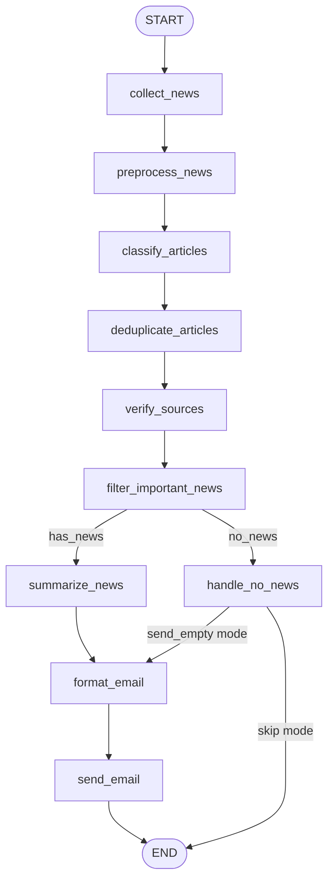
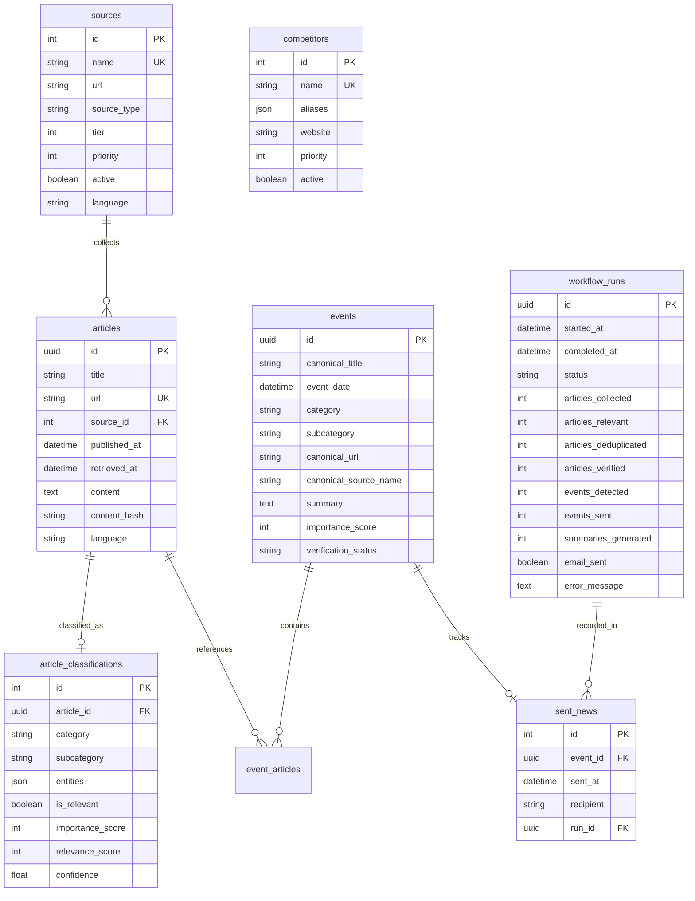

# Forsa Financial News Monitoring Agent

An autonomous, production-grade AI agent designed specifically for the executive leadership (CEO & Executive Committee) of **Forsa** (Drive Finance) in Egypt. The agent continuously monitors the Egyptian financial ecosystem, filters regulatory and market signals, deduplicates cross-publisher reports into unified events, verifies facts against official sources, synthesizes factual executive summaries, and delivers a curated intelligence digest via email.

> **Key Architectural Principle:** This is **not a chatbot** and has no conversational interface. It is an autonomous, stateful, headless execution graph built on **LangGraph**. It runs on a schedule (or cloud trigger), executes its end-to-end data pipeline, persists state and idempotency records to a PostgreSQL database, delivers executive intelligence, and terminates cleanly.

---

## Table of Contents

1. [Executive Purpose & Business Context](#executive-purpose--business-context)
2. [Domain Scope & Operational Guardrails](#domain-scope--operational-guardrails)
3. [End-to-End System Architecture](#end-to-end-system-architecture)
   - [Pipeline Topology (LangGraph)](#pipeline-topology-langgraph)
   - [Core Architectural Layers](#core-architectural-layers)
   - [Data Flow & State Management](#data-flow--state-management)
4. [Resilient News Retrieval & Fallback Engine](#resilient-news-retrieval--fallback-engine)
5. [Deduplication & Verification Stack](#deduplication--verification-stack)
6. [Executive Summarization & Brand Normalization](#executive-summarization--brand-normalization)
7. [Delivery & Cloud Scheduling Infrastructure](#delivery--cloud-scheduling-infrastructure)
8. [Database Schema & Data Persistence](#database-schema--data-persistence)
9. [Configuration Reference](#configuration-reference)
10. [Setup & Operations](#setup--operations)
11. [Testing & Evaluation](#testing--evaluation)
12. [Project Directory Layout](#project-directory-layout)

---

## Executive Purpose & Business Context

### The Problem
Executive leadership in the Egyptian consumer finance and Non-Banking Financial Institutions (NBFI) sector face significant information friction:
- **Information Overload & Noise:** Hundreds of general banking, macroeconomic, and commodity news articles are published daily that have zero operational relevance to a consumer finance business.
- **Transliteration & Terminology Discrepancies:** Brand names and regulatory terms across Arabic and English publications vary widely (e.g., *Souhoola* transliterated as *SooLa*, *valU* as *Valiu*, *Blnk* as *Blink*).
- **Repetitive PR Syndication:** A single corporate partnership or regulatory release is syndicated across 10+ Egyptian news portals with nearly identical phrasing.
- **Unverified & Hallucinatory Reporting:** Generic AI aggregators often hallucinate financial commentary or blur the lines between official decrees and rumor.

### The Purpose
The **Forsa News Agent** automates the entire competitive and regulatory intelligence lifecycle:
1. **Monitors Primary Regulators & Competitors:** Directly scrapes official releases from the Financial Regulatory Authority (FRA) and tracks key consumer lending competitors (valU, MNT-Halan, Souhoola, Contact Financial, Aman, Sympl, Blnk, Fawry, etc.).
2. **Eliminates Noise at the Ingestion Boundary:** Filters out irrelevant commercial banking news, Central Bank of Egypt (CBE) interest rate decisions, treasury auctions, food/commodity prices, and student competitions.
3. **Consolidates Coverage into Single Events:** Employs a 5-tier deduplication stack (combining content hashing, fuzzy title matching, entity overlap, and vector embeddings) to group redundant media reports into a single canonical event.
4. **Enforces Strict Provenance:** Assigns verification tiers (`OFFICIAL`, `VERIFIED`, `UNVERIFIED`) based on domain provenance.
5. **Generates Purely Factual Summaries:** Summarizes each event using Google Gemini with strict anti-hallucination and no-analysis constraints. The CEO receives concrete facts, numbers, dates, and official source links—never speculative AI opinions.
6. **Guarantees Zero Duplicate Emails (Idempotency):** Every sent event is recorded in a PostgreSQL database; subsequent runs skip previously delivered intelligence even if re-reported by other outlets.

---

## Domain Scope & Operational Guardrails

The agent operates under strictly defined domain boundaries tailored for Forsa as a licensed Consumer Finance company:

```
┌────────────────────────────────────────────────────────────────────────┐
│                        MONITORING SCOPE BOUNDARIES                     │
├───────────────────────────────────┬────────────────────────────────────┤
│           IN SCOPE (YES)          │        OUT OF SCOPE (DROPPED)      │
├───────────────────────────────────┼────────────────────────────────────┤
│ • Financial Regulatory Authority  │ • Central Bank of Egypt (CBE)      │
│   (FRA) decrees, circulars &      │   commercial banking regulations,  │
│   supervisory manuals             │   reserve ratios & MPC rate alerts │
│ • Consumer Finance (Law 18/2020)  │ • Treasury bills & bonds auctions  │
│ • BNPL & digital installment apps │ • Food, commodity, shipping, and   │
│ • I-Score integration & rules     │   freight price tracking           │
│ • e-KYC, digital onboarding & OTP │ • Academic hackathons, student     │
│ • Consumer credit debt burden caps│   competitions, internal awards    │
│ • Direct competitor product offers│ • Marine, fire & traditional       │
│   partnerships, fundraises & deals│   insurance pool announcements     │
│ • Securitization bond issuances   │ • Unsubstantiated clickbait stubs  │
│ • EGX30 weekly market recap       │   without concrete financial facts │
└───────────────────────────────────┴────────────────────────────────────┘
```

> **Why is Central Bank of Egypt (CBE) news excluded?**  
> Forsa is an NBFI licensed under the **Financial Regulatory Authority (FRA)** pursuant to Egyptian Consumer Finance Law No. 18 of 2020. Forsa is not a deposit-taking commercial bank regulated by the Central Bank of Egypt. CBE monetary policy decisions, bank reserve requirements, and interbank liquidity operations are intentionally filtered out to keep executive reporting strictly focused on consumer lending, BNPL, and direct regulatory compliance.

---

## End-to-End System Architecture

### Pipeline Topology (LangGraph)

The core engine is implemented as a compiled state graph using **LangGraph**. Execution moves deterministically through specialized functional nodes with conditional branches handling importance filtering and "no news" scenarios:



### Core Architectural Layers

The system is organized into modular decoupled layers:

```
┌────────────────────────────────────────────────────────────────────────┐
│                        FORSA NEWS AGENT LAYERS                         │
├────────────────────────────────────────────────────────────────────────┤
│ 1. INGESTION & SEARCH RESILIENCE                                       │
│    FRA Collector │ SerpAPI Search │ Google News RSS │ Web Scrapers     │
├────────────────────────────────────────────────────────────────────────┤
│ 2. PREPROCESSING & ENRICHMENT                                          │
│    HTML Strip │ Unicode NFC │ Mojibake Fix │ Full-Text Article Hydration│
├────────────────────────────────────────────────────────────────────────┤
│ 3. MULTI-STAGE CLASSIFICATION                                          │
│    Keyword Pre-filter (Free) → Domain Rules → Gemini Flash LLM        │
├────────────────────────────────────────────────────────────────────────┤
│ 4. DEDUPLICATION & VERIFICATION                                        │
│    URL Match → SHA-256 → Fuzzy Title → Entity/Time → Embeddings Cosine │
│    Tier 1 (Official) │ Tier 2 (Verified Media) │ Tier 3 (Unverified)   │
├────────────────────────────────────────────────────────────────────────┤
│ 5. EXECUTIVE CURATION & FACTUAL SUMMARIZATION                          │
│    Gemini Pro/Flash Factual Synthesis │ Brand Spelling Normalization   │
├────────────────────────────────────────────────────────────────────────┤
│ 6. EXECUTIVE DELIVERY & IDEMPOTENCY                                    │
│    Power Automate Webhook │ M365 Graph API │ SMTP │ PostgreSQL Ledger  │
└────────────────────────────────────────────────────────────────────────┘
```

### Data Flow & State Management

The pipeline maintains a single strongly-typed state object (`AgentState`) that accumulates metadata and enriched data as it progresses through each node:

| Node | Input Fields | Output / Mutated Fields | Primary Function |
|---|---|---|---|
| `collect_news` | `collection_start`, `collection_end` | `raw_articles`, `stats` | Concurrently fetches from official scrapers and `SearchManager`. Deduplicates raw articles by URL and persists to DB. |
| `preprocess_news` | `raw_articles` | `clean_articles` | Strips boilerplate, sanitizes HTML, resolves character encodings, and fetches full body text for truncated articles. |
| `classify_articles` | `clean_articles` | `classifications`, `relevant_articles` | Three-stage classification: keyword pre-filter, deterministic business rules, and Gemini Flash LLM. |
| `deduplicate_articles` | `relevant_articles`, `classifications` | `events` | Groups related articles into unified `NewsEvent` objects using the 5-signal deduplication stack. |
| `verify_sources` | `events` | `events` (updated `verification_status`) | Assigns `OFFICIAL`, `VERIFIED`, or `UNVERIFIED` badges based on source authority. |
| `filter_important_news` | `events` | `important_events` | Scores event importance (0–100), applies `IMPORTANCE_THRESHOLD`, and verifies against `sent_news` database table to guarantee idempotency. |
| `summarize_news` | `important_events` | `important_events` (attached `summary`) | Generates concise factual English summaries with Gemini, applies brand spelling correction, and rejects stubs. |
| `format_email` | `important_events` | `email_subject`, `email_html`, `email_plain` | Formats responsive HTML and plain text executive emails categorized by importance and topic. |
| `handle_no_news` | `events` | `email_subject`, `email_html`, `email_plain`, `email_sent` | Executes when zero important news items pass filters. Respects `NO_NEWS_BEHAVIOUR` (`skip` or `send_empty`). |
| `send_email` | `email_html`, `email_plain`, `email_subject` | `email_sent` | Delivers the email via the configured provider, records sent events in `sent_news`, and marks the run completed. |

---

## Resilient News Retrieval & Fallback Engine

News collection is governed by the `SearchManager`, designed for high availability and zero cost lock-in. It dynamically switches to free alternative channels if primary search APIs are exhausted or rate-limited:

```mermaid
flowchart TD
    A[Start Search Collection] --> B{Pre-flight SerpAPI Check}
    B -->|Quota Available| C[Execute SerpAPI Google News & Competitor Search]
    C --> D{Success?}
    D -->|Yes| E[Collect Normalized Articles]
    D -->|429 / Quota Error / 0 Results| F[Activate Fallback Retrieval Engine]
    B -->|Quota Exhausted / Disabled| F

    subgraph Fallback Engine (Zero API Cost)
        F --> G[Query Google News Free RSS Endpoints]
        F --> H[Fetch Publisher RSS Feeds: Amwal Al Ghad, DNE, Al Borsa]
        F --> I[Scrape Direct Website Sections: Enterprise, Techpoint]
    end

    G --> J[Normalize Article Format]
    H --> J
    I --> J
    J --> K[Relevance & Lookback Date Filter]
    K --> L[Multi-level Dedup]
    E --> L
    L --> M[Persist Unique Articles to Database]
```

1. **Pre-flight Health Check (`serpapi_checker.py`):** Queries SerpAPI account status before making search calls. If remaining quota < `SERPAPI_MIN_SEARCHES` (default: 5), it bypasses SerpAPI immediately to prevent mid-run failures.
2. **In-Flight Circuit Breaker:** If a `429 Too Many Requests` or quota exhaustion occurs during active searches, `SearchManager` catches the exception and gracefully activates the fallback retrieval system.
3. **Fallback Retrieval Sources:**
   - **Google News Query-based RSS:** Bypasses API keys by dynamically querying Google News RSS feeds for Egyptian competitors and financial terms.
   - **Publisher RSS Feeds:** Ingests live RSS feeds from major Egyptian financial publications (*Amwal Al Ghad, Daily News Egypt, Al Borsa News, Economy Plus*).
   - **Direct Web Scrapers:** Periodically inspects specific financial sections of selected sites.
4. **Article Normalization:** Converts articles from all sources into a unified Pydantic schema with standardized ISO dates, clean canonical URLs, and content hashes.

---

## Deduplication & Verification Stack

### Multi-Signal Deduplication Stack

Multiple publishers frequently syndicate the exact same press release or report on the same event with different wording. The agent applies an ordered 5-signal pipeline:

```
┌─────────────────────────────────────────────────────────────┐
│ 1. Canonical URL Match       (Instant match; normalized)    │
│    ↓ (no match)                                             │
│ 2. Content SHA-256 Hash      (Exact body match)             │
│    ↓ (no match)                                             │
│ 3. Fuzzy Title Similarity    (Token Sort Ratio ≥ 85%)       │
│    ↓ (no match)                                             │
│ 4. Entity & Time Window      (Shared entities within 24h)   │
│    ↓ (no match)                                             │
│ 5. Vector Cosine Similarity  (Gemini embeddings ≥ 0.85)     │
└─────────────────────────────────────────────────────────────┘
```

- **Domain-Specific Cross-Topic Protection:** Specialized topic guards ensure that distinct regulatory actions issued on the same day (e.g., I-Score Decision No. 174 vs. Real Estate Valuation Decision No. 191) are not incorrectly collapsed into a single event.

### Source Verification & Provenance

Every incoming story is evaluated against a trusted registry:
- **`OFFICIAL` (Tier 1):** Direct statutory and regulatory bodies (FRA, Egyptian Gazette, Official Authority portals).
- **`VERIFIED` (Tier 2):** Accredited mainstream financial and economic publications (*Enterprise, Al Borsa News, Daily News Egypt, Amwal Al Ghad, Economy Plus, Mubasher*).
- **`UNVERIFIED` (Tier 3):** General press, regional blogs, or unvetted aggregators.

---

## Executive Summarization & Brand Normalization

### Strict Factual Constraint
The summarization node uses **Google Gemini** with structured prompt engineering designed specifically for executive consumption:
- **No Speculative Analysis:** The model is forbidden from answering *"What this means for Forsa"* or generating unprompted business advice.
- **Strict Grounding:** Summaries must be 100% grounded in the extracted text. If an article is a stub or lacks concrete data, it is flagged as a stub and dropped.
- **English Output with Neutral Tone:** All Arabic and English source articles are synthesized into clear, high-level executive English.

### Brand Spelling Normalization Engine (`spelling.py`)
To eliminate embarrassing machine-translation errors or phonetic transliterations in executive emails, a deterministic post-processing layer enforces canonical corporate brand spellings:

| Raw Transliteration / Misspelling | Canonical Executive Output |
|---|---|
| *SooLa, Sohoola, Sahula, Suhula, سهولة* | **Souhoola** |
| *Valiu, Falio, Valyou, فاليو* | **valU** |
| *Mnt-Halan, MNT Halan, حالا* | **MNT-Halan** |
| *Blink Consumer Finance, Blank, بلنك* | **Blnk** |
| *Simple BNPL, Sembl, سيمبل* | **Sympl** |
| *Btech, B-Tech, بي تك* | **B.TECH** |
| *Faury, Fawri, فوري* | **Fawry** |
| *Shahri, شهري* | **Shahry** |
| *i-score, iscore, IScore* | **I-Score** |
| *instapay, instaPay* | **InstaPay** |

---

## Delivery & Cloud Scheduling Infrastructure

### Tri-Mode Email Delivery

The agent provides native support for three delivery mechanisms configured via `EMAIL_PROVIDER`:

1. **Microsoft Power Automate HTTP Flow (`power_automate`) — Recommended for Corporate M365:**
   - Dispatches a secure JSON payload to an Azure/Power Automate HTTP trigger webhook.
   - Power Automate delivers the email directly using the corporate Outlook/Exchange connector.
   - **Zero IT Admin Friction:** Does not require Azure App Registrations, SMTP relay passwords, or tenant admin approval.
2. **Microsoft Graph API (`microsoft365`):**
   - Direct enterprise OAuth 2.0 client credentials authentication (`https://graph.microsoft.com`).
   - Requires Azure App Registration (`Mail.Send` application permissions).
3. **Standard SMTP (`smtp`):**
   - Native Python `smtplib` delivery supporting STARTTLS and SSL.

### Executive Email Formatting
- **Visual Category Hierarchy:**
  - 🔴 **FRA & Regulation:** Critical statutory and regulatory compliance mandates.
  - 🟠 **Consumer Finance & Competitors:** Competitor promotions, deals, and market moves.
  - 🟡 **FinTech & Financial Market:** Digital wallets, payment infrastructure, and EGX30 weekly summaries.
- **Executive Cleanliness:** Internal importance scores (e.g., `85/100`), AI prompts, and raw system IDs are strictly excluded from the rendered email. Each event displays only its canonical title, structured summary, verified source, publication date (Cairo time), and direct link.

### "No News" Handling
When no articles meet the importance threshold (`IMPORTANCE_THRESHOLD = 60`):
- `NO_NEWS_BEHAVIOUR=skip` (Production default): Terminates silently, logs the clean run to the database, and sends **zero** emails to prevent executive inbox clutter.
- `NO_NEWS_BEHAVIOUR=send_empty`: Sends a formal, concise notification confirming the system executed successfully and identified no critical events.

### Dual-Tier Scheduling & Orchestration
1. **Cloud Serverless (Production):** A scheduled cloud flow in **Microsoft Power Automate** triggers the **GitHub Actions** workflow (`weekly_news.yml`) every Sunday at 08:30 AM Cairo time. GitHub Actions executes the pipeline inside an isolated runner and posts runtime logs to GitHub Step Summaries.
2. **Local / Server Daemon:** An in-process `AsyncIOScheduler` (APScheduler) runs inside `app/main.py` with timezone support (`Africa/Cairo`).

---

## Database Schema & Data Persistence

The system uses a PostgreSQL database managed via **SQLAlchemy 2.0 Async** (`asyncpg`) and **Alembic**:



---

## Configuration Reference

All application parameters are managed via environment variables or a local `.env` file (parsed by `app/config.py`):

| Variable | Type | Default | Description |
|---|---|---|---|
| `DATABASE_URL` | String | *Required* | PostgreSQL async connection URL (`postgresql+asyncpg://...`) |
| `GOOGLE_API_KEY` | String | *Required* | Google Gemini AI API key |
| `GEMINI_CLASSIFY_MODEL` | String | `gemini-flash-latest` | Model used for classification & scoring |
| `GEMINI_SUMMARIZE_MODEL`| String | `gemini-flash-latest` | Model used for executive summarization |
| `SERPAPI_KEY` | String | *Required* | SerpAPI key for Google News searches |
| `FORCE_SEARCH_FALLBACK` | Boolean | `false` | Force free fallback retrieval even if SerpAPI has quota |
| `SERPAPI_MIN_SEARCHES` | Integer | `5` | Minimum searches remaining before auto-switching to fallback |
| `EMAIL_PROVIDER` | Enum | `power_automate` | Provider: `power_automate`, `microsoft365`, or `smtp` |
| `POWER_AUTOMATE_WEBHOOK_URL` | String | `""` | HTTP trigger URL for Power Automate flow |
| `MICROSOFT_TENANT_ID` | String | `""` | Azure AD Tenant ID (for `microsoft365`) |
| `MICROSOFT_CLIENT_ID` | String | `""` | Azure App Client ID (for `microsoft365`) |
| `MICROSOFT_CLIENT_SECRET` | String | `""` | Azure App Client Secret (for `microsoft365`) |
| `SMTP_HOST` | String | `""` | SMTP hostname (for `smtp`) |
| `SMTP_PORT` | Integer | `587` | SMTP port |
| `SMTP_USER` | String | `""` | SMTP username |
| `SMTP_PASS` | String | `""` | SMTP password |
| `SMTP_USE_TLS` | Boolean | `true` | Enable STARTTLS |
| `EMAIL_RECIPIENT` | String | *Required* | Recipient email address (CEO / Executive Committee) |
| `EMAIL_FROM` | String | `Forsa News Agent <...>` | Sender address and display name |
| `SCHEDULE_FREQUENCY` | Enum | `weekly` | `weekly`, `daily`, `hourly`, `twice_daily`, `custom_cron` |
| `SCHEDULE_DAY_OF_WEEK` | String | `sun` | Day of week for weekly schedule (`mon`–`sun`) |
| `SCHEDULE_TIME` | String | `08:30` | Execution time (HH:MM) in local timezone |
| `TIMEZONE` | String | `Africa/Cairo` | Local timezone for execution and reporting |
| `OVERLAP_HOURS` | Integer | `6` | Overlap window to capture delayed syndicated stories |
| `INITIAL_LOOKBACK_HOURS`| Integer | `168` | Initial lookback window (168 hours = 7 days) |
| `IMPORTANCE_THRESHOLD` | Integer | `60` | Minimum score (0–100) for an event to be emailed |
| `RELEVANCE_THRESHOLD` | Integer | `50` | Minimum score (0–100) for raw article qualification |
| `SIMILARITY_THRESHOLD` | Float | `0.85` | Embedding cosine threshold for semantic dedup |
| `TITLE_SIMILARITY_THRESHOLD` | Integer | `85` | Token Sort Ratio threshold (0–100) for title dedup |
| `NO_NEWS_BEHAVIOUR` | Enum | `skip` | Action when zero news: `skip` (silent) or `send_empty` |
| `ENVIRONMENT` | Enum | `production` | `development`, `production`, or `test` |

---

## Setup & Operations

### 1. Installation

```powershell
# Clone the repository
cd "d:\Tasks\Forsa News Agent"

# Create and activate a Python 3.11+ virtual environment
py -3 -m venv .venv
.venv\Scripts\Activate.ps1

# Install production and development dependencies
pip install -r requirements.txt
```

### 2. Environment Configuration

```powershell
Copy-Item .env.example .env
# Open .env and insert your database credentials and API keys
notepad .env
```

### 3. Database Initialization & Seeding

```powershell
# Initialize all database tables
py -3 app/main.py --init-db

# Or run Alembic migrations
py -3 -m alembic upgrade head

# Seed initial news sources and competitor watchlist
py -3 scripts/seed_sources.py
py -3 scripts/seed_competitors.py
```

### 4. Running the Agent

```powershell
# Run a single manual run with 7-day lookback (production test)
py -3 app/main.py --run-now --days 7

# Run manual test bypassing sent-news check (forces email resend)
py -3 app/main.py --run-now --days 7 --ignore-sent

# Run manual test forcing the free fallback retrieval engine
py -3 app/main.py --run-now --days 7 --force-fallback

# Start in continuous scheduler daemon mode
py -3 app/main.py
```

---

## Testing & Evaluation

The repository includes a comprehensive, isolated test suite that verifies individual components, full pipeline integration, and LLM output quality:

```powershell
# 1. Run all Unit Tests (mocked, no DB or API calls required)
py -3 -m pytest tests/unit/ -v

# 2. Run Integration Tests (mocked LangGraph pipeline flow)
py -3 -m pytest tests/integration/ -v

# 3. Test Email Provider Delivery
py -3 scripts/test_email.py

# 4. Run AI Evaluation Suite (assesses LLM precision and brand accuracy)
py -3 tests/evaluation/eval_runner.py
```

### Key Test Suites
- [`test_executive_curation.py`](file:///d:/Tasks/Forsa%20News%20Agent/tests/unit/test_executive_curation.py): Validates strict exclusion of CBE interest rates, commodity prices, and university contests.
- [`test_search_fallback.py`](file:///d:/Tasks/Forsa%20News%20Agent/tests/unit/test_search_fallback.py): Validates automatic fallback to RSS/Scrapers when SerpAPI quota is exhausted.
- [`test_spelling.py`](file:///d:/Tasks/Forsa%20News%20Agent/tests/unit/test_spelling.py): Validates brand spelling preservation (*valU, MNT-Halan, Souhoola, Blnk, Sympl*).
- [`test_no_news_behaviour.py`](file:///d:/Tasks/Forsa%20News%20Agent/tests/unit/test_no_news_behaviour.py): Validates `skip` and `send_empty` routing behaviors.
- [`test_deduplication.py`](file:///d:/Tasks/Forsa%20News%20Agent/tests/unit/test_deduplication.py): Validates multi-signal deduplication and cross-topic separation.

---

## Project Directory Layout

```
forsa-news-agent/
├── .github/
│   └── workflows/
│       └── weekly_news.yml           # GitHub Actions workflow for scheduled execution
├── app/
│   ├── collectors/
│   │   ├── base.py                   # NewsSourceCollector abstract base class
│   │   ├── cbe.py                    # CBE scraper (archived / disabled)
│   │   ├── fra.py                    # FRA official portal scraper (Tier 1)
│   │   ├── rss.py                    # Generic RSS/Atom collector
│   │   └── search.py                 # SerpAPI Google News & Competitors search
│   ├── database/
│   │   ├── connection.py             # Async SQLAlchemy engine & session factory
│   │   ├── models.py                 # Declarative ORM models
│   │   ├── repositories.py           # Repository pattern for DB operations
│   │   └── migrations/               # Alembic database migrations
│   ├── graph/
│   │   ├── graph.py                  # LangGraph StateGraph topology and compilation
│   │   ├── state.py                  # AgentState & RunStats TypedDict definitions
│   │   └── nodes/
│   │       ├── collect.py            # Node 1: Multi-source parallel ingestion
│   │       ├── preprocess.py         # Node 2: HTML sanitization & full-text hydration
│   │       ├── classify.py           # Node 3: 3-stage keyword/rule/LLM classification
│   │       ├── deduplicate.py        # Node 4: 5-signal event deduplication
│   │       ├── verify.py             # Node 5: Source tiering (Official/Verified)
│   │       ├── filter.py             # Node 6: Importance scoring & idempotency check
│   │       ├── summarize.py          # Node 7: Factual Gemini executive summaries
│   │       ├── format_email.py       # Node 8: Executive email layout & no-news handler
│   │       └── send_email.py         # Node 9: Multi-provider delivery & DB ledger update
│   ├── models/
│   │   ├── article.py                # Article & ArticleClassification Pydantic models
│   │   └── event.py                  # NewsEvent & EventSummary Pydantic models
│   ├── search/
│   │   ├── article_normalizer.py     # Schema normalizer and URL sanitizer
│   │   ├── relevance_filter.py       # Keyword & date window filter for fallback items
│   │   ├── rss_search.py             # Google News RSS & Publisher RSS collector
│   │   ├── search_manager.py         # Central orchestrator with automatic fallback
│   │   ├── serpapi_checker.py        # SerpAPI pre-flight quota inspector
│   │   └── website_search.py         # Direct financial website scraping fallback
│   ├── services/
│   │   ├── deduplication.py          # 5-tier multi-signal deduplication service
│   │   ├── email.py                  # Power Automate, M365 Graph, & SMTP email service
│   │   ├── embeddings.py             # Google Gemini text embeddings service
│   │   ├── llm.py                    # Google Gemini LLM API client
│   │   ├── spelling.py               # Deterministic brand spelling normalization
│   │   └── verification.py           # Source URL verification service
│   ├── config.py                     # Pydantic BaseSettings centralized configuration
│   └── main.py                       # CLI entry point, APScheduler, & window calculator
├── docs/
│   └── POWER_AUTOMATE_SCHEDULER_SETUP.md # Step-by-step corporate cloud flow setup guide
├── scripts/
│   ├── run_once.py                   # Script for manual test runs
│   ├── seed_competitors.py           # Seeds Egyptian competitors watchlist
│   ├── seed_sources.py               # Seeds official and media RSS sources
│   └── test_email.py                 # Smoke test for email delivery providers
├── tests/
│   ├── unit/                         # Unit tests for all core nodes and services
│   ├── integration/                  # End-to-end mocked pipeline integration tests
│   └── evaluation/                   # LLM evaluation runner and sample test dataset
├── .env.example                      # Configuration template
├── alembic.ini                       # Alembic migration configuration
├── pytest.ini                        # Pytest configuration
├── requirements.txt                  # Python dependencies
└── README.md                         # Project documentation
```
